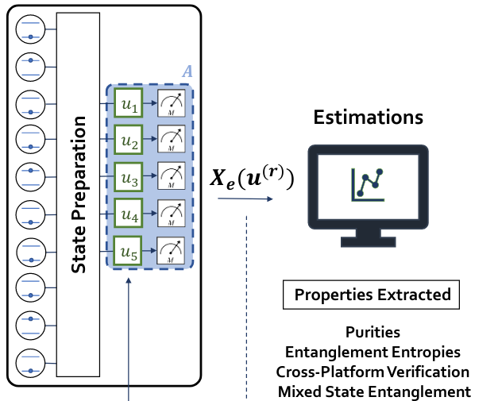

# RandomMeas: Python Interface to random measurements

We provide scripts to reconstruct the purity and cross-platform fidelities from randomized measurements.

## Purity from randomized measurements
The purity is reconstructed from statistical correlations between randomized measurements, which are obtained via random single qubit gates

+ [Original Paper](https://science.sciencemag.org/content/364/6437)
+ [Python Script](PurityRM.py)
+ Typical use: Up to 10 qubits

## Fidelities from randomized measurements
The fidelity between quantum states realized on two different quantum devices is obtained by cross-correlating randomized measurements.

+ [Original Paper](https://journals.aps.org/prl/abstract/10.1103/PhysRevLett.124.010504)
+ [Python Script](FidelityRM.py)
+ Typical use: Up to 10 qubits

## Purity from importance sampling of randomized measurements
The purity is obtained with exponentially less measurements compared to the standard approach of uniform sampling. This is based on importance sampling of random single qubit unitaries, with respect to an approximation of the quantum state.

+ [Original Paper](https://arxiv.org/abs/2102.13524)
+ [Tutorial](TutorialImportanceSampling.ipynb)
+ [Python Script](PurityImportanceSampling.py)
+ Typical use: Up to 24 qubits

## Topological entanglement entropy from importance sampling of randomized measurements
The topological entanglement entropy "S_topo" is obtained with an order of magnitude less measurements compared to the standard approach of uniform sampling using  importance sampling of random single qubit unitaries, with respect to the modelled approximation of the quantum state.

+ [Original Paper](https://arxiv.org/pdf/2104.01180.pdf)
+ [Python Script](PurityImportanceSamplingToric_Code.py)
+ Typical use: Up to 15 qubits

License: Apache 2.0

Second version: Oct 2021
